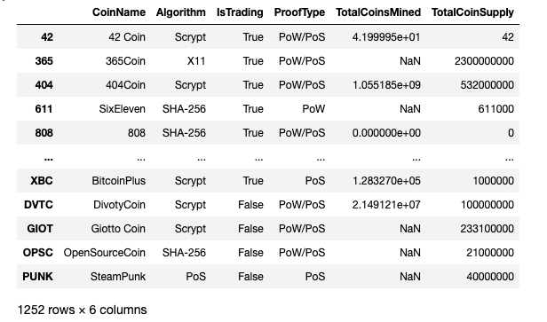
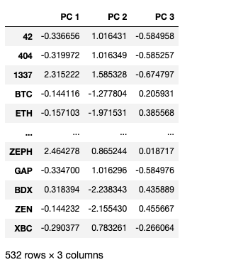
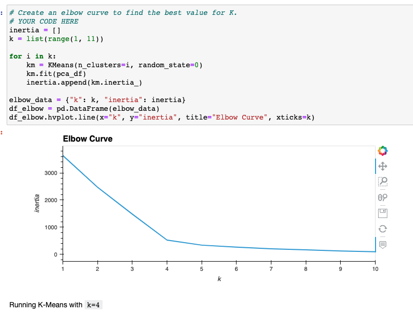
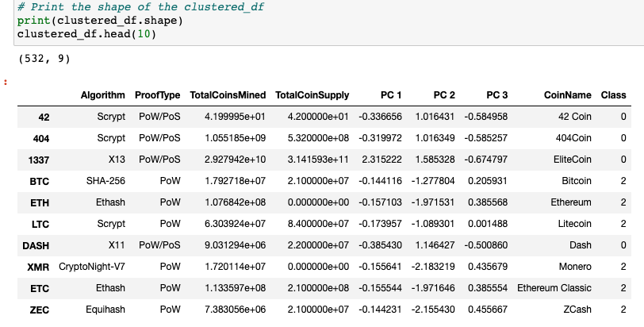
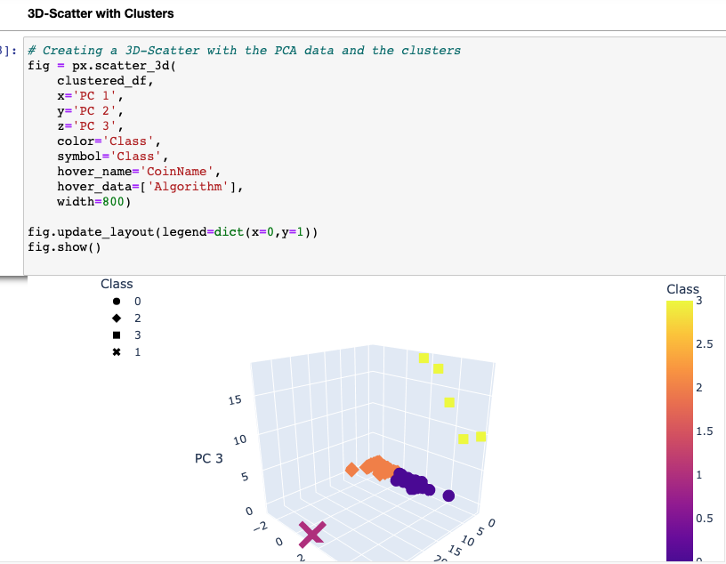
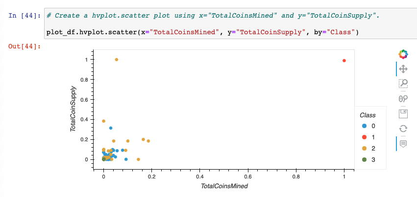

# Cryptocurrencies

## Project Overview
Martha and I believe that cryptocurrencies can change the world, and we wante to be part of it. In this project, I am going to help Martha to pitch an investment in cryptocurrency to her firm Accountibility accounting. Bitcoin had become so popular that its price jumped so high for many new investers to afford it. But there are many more cryptocurrencies available at more affordable prices. My job is to help Martha to analyze the data set of cryptocurrencies and discover trends that will convince her firm to invest in these new more affordable cryptocurrencies. 

We will use the raw data downloaded from the internet, and do the following steps to clean, process and analyze the data.

- Preprocessing the Data for PCA
- Reducing Data Dimensions Using PCA
- Clustering Crytocurrencies Using K-Means
- Visualizing Cryptocurrencies Results

### Data Resources:
https://min-api.cryptocompare.com/data/all/coinlist

## Process 
### The Original Data

### Reducing Data Dimensions Using PCA

## Clustering Crytocurrencies Using K-Means

## Result
### Cleaned and Processed Data

### Visualizing Cryptocurrencies Results

